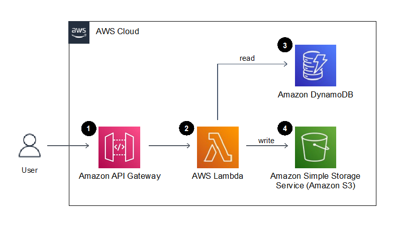

# serverless-aws-application
A serverless application using AWS Lambda, API Gateway, DynamoDB, and S3"
# Serverless Application with AWS Lambda, API Gateway, DynamoDB, and S3

This project demonstrates a serverless application using AWS services: Lambda, API Gateway, DynamoDB, and S3. It uses an event-driven architecture where files uploaded to S3 trigger a Lambda function, which stores metadata in DynamoDB.

 Features
- **Lambda**: Handles backend logic.
- **API Gateway**: Exposes RESTful APIs.
- **DynamoDB**: NoSQL storage for file metadata.
- **S3**: Stores uploaded files.

 Setup
1. Deploy infrastructure using the CloudFormation template in `templates/cloudformation.yaml`.
2. Add backend logic in `app/lambda_function.py`.
3. Run `scripts/deploy.sh` to automate setup.

## Architecture
